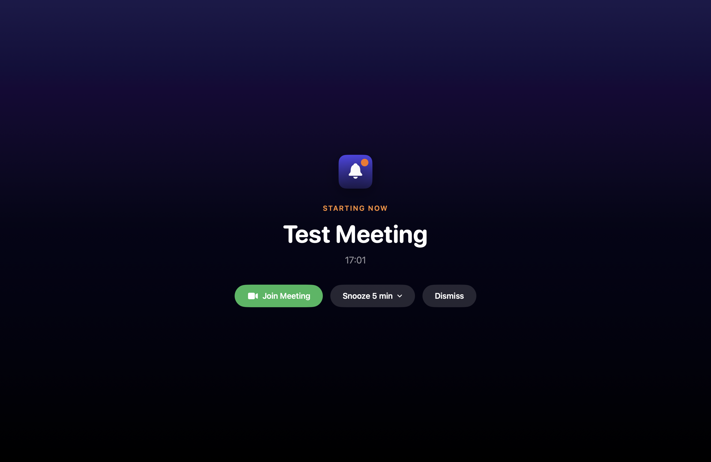
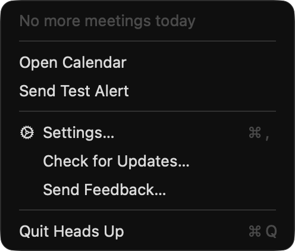
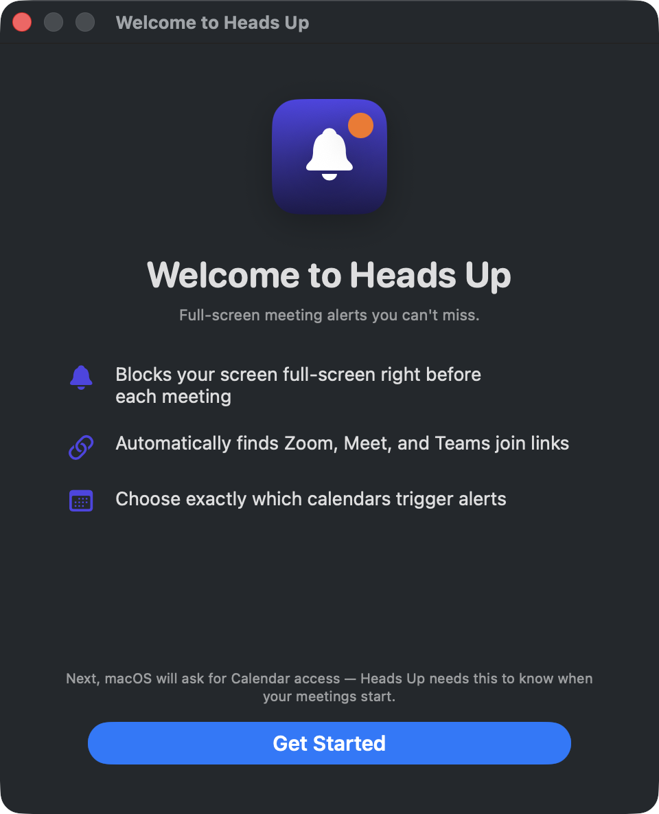
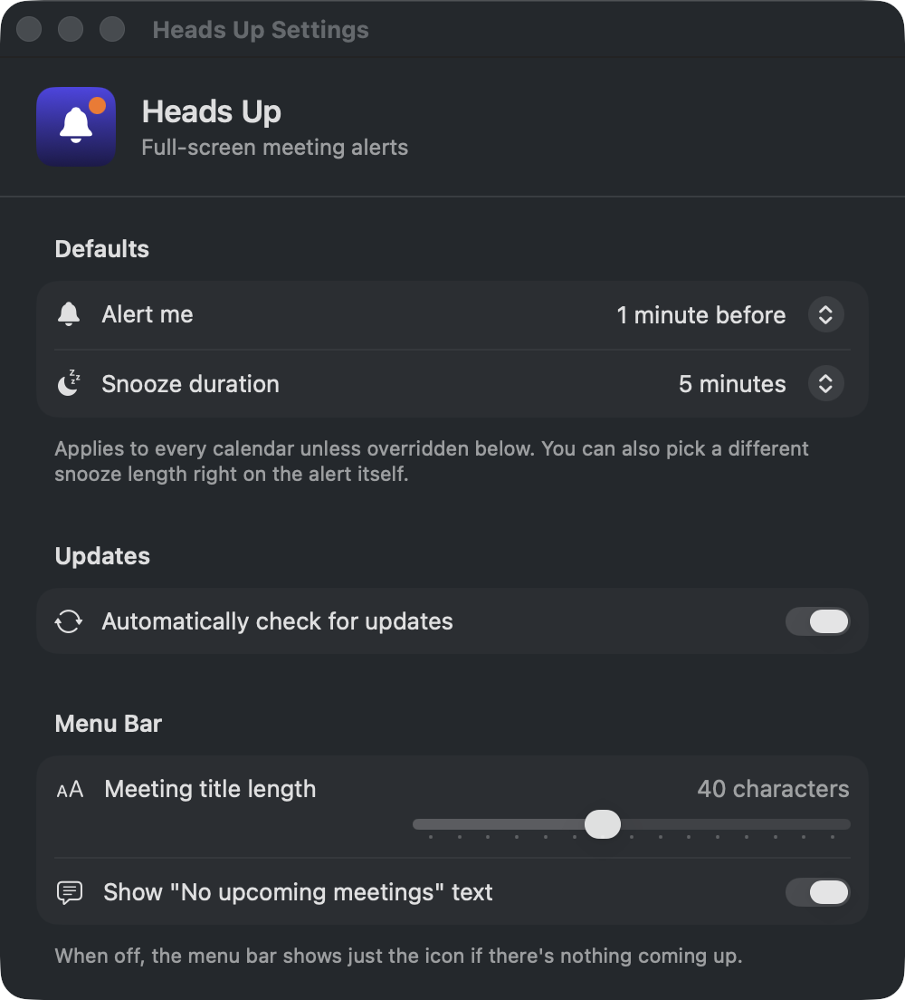

<p align="center">
  
</p>

<h1 align="center">Heads Up</h1>

A macOS menu-bar app that blocks your screen full-screen just before a meeting starts, so you can't miss it.

<p align="center">
  
</p>

## What it does

- Reads events from every calendar connected to macOS Calendar (Google, Outlook, iCloud — anything Calendar.app syncs) via EventKit.
- Detects a meeting join link on each event, checking the event URL, then location, then notes, preferring known providers (Zoom, Google Meet, Teams, Webex, and others — see `Sources/HeadsUp/MeetingLink.swift`).
- Shows a full-screen, borderless alert on every display — above other windows and full-screen apps — a configurable amount of time before each meeting (default: 1 minute before).
- Alert has Join, Snooze, and Dismiss; snooze duration is configurable per-alert (a quick default, or a menu of other lengths) as well as in Settings.
- If two meetings overlap, both are shown together rather than silently picking one.
- The tray icon switches to a filled state while a meeting is in progress.

<p align="center">
   &nbsp;&nbsp;&nbsp;
  
</p>

- Menu bar dropdown lists the rest of today's meetings, each with a Join icon if a link was detected, or its location (e.g. a room name) if not.
- A "Grant Calendar Access…" item appears in the tray whenever access isn't authorized, and a "Check for Updates…" item for manual update checks.
- A proper Settings window (Cmd+, or the tray menu) for the default alert lead time, snooze duration, per-calendar include/exclude + lead-time override, menu bar title length, and automatic update checks.
- A first-launch Welcome screen explaining what the app does before asking for Calendar access.
- "Send Test Alert" and "Send Feedback…" (opens GitHub Issues) menu items.

<p align="center">
   &nbsp;&nbsp;&nbsp;
  
</p>

## Install

1. Download the latest `HeadsUp-<version>.dmg` from [Releases](https://github.com/rufushonour/headsup/releases), open it, and drag Heads Up into Applications.
2. Open `HeadsUp.app` from Applications.
3. Approve the Calendar access prompt when it appears.

The app is signed with a Developer ID and notarized by Apple, so it opens normally with no Gatekeeper warning.

## Requirements

- macOS 13+. Uses the granular macOS 14+ EventKit permission API when available, falling back to the legacy API on macOS 13.
- Calendar access — macOS prompts on first launch. Approve it in System Settings → Privacy & Security → Calendars if you miss the prompt.

## Build & run

```
./Scripts/build_app.sh          # debug build -> build/HeadsUp.app
./Scripts/build_app.sh release  # release build
open build/HeadsUp.app
```

The script compiles via Swift Package Manager, packages the binary into a proper `.app` bundle with `Info.plist` (needed for the Calendar permission prompt to attach to the app rather than to Terminal), and signs it — ad-hoc by default, which is what you want for local development. Set `CODESIGN_IDENTITY` to sign with a Developer ID instead (only useful alongside notarization, e.g. via `release.sh`; an unnotarized Developer ID signature is rejected more aggressively by Gatekeeper than ad-hoc and will silently break Calendar access prompts — see `AGENTS.md`).

To build the `.dmg` used for GitHub Releases:

```
./Scripts/build_dmg.sh          # release build -> build/HeadsUp-<version>.dmg
```

This runs `build_app.sh release` first, then stages the `.app` alongside an `Applications` symlink and packs it with `hdiutil` — the standard drag-to-Applications layout.

## Cutting a release

```
./Scripts/cut_release.sh 0.1.1
```

This bumps the version in `Resources/Info.plist`, commits and pushes it to `main`, then creates and pushes the matching `vX.Y.Z` tag. Pushing that tag triggers `.github/workflows/release.yml` on GitHub Actions, which imports the Developer ID signing certificate, builds and notarizes the `.dmg`, signs a new `appcast.xml` entry (Sparkle/EdDSA), commits the updated appcast back to `main`, and publishes the GitHub Release with the `.dmg` attached. Watch it with `gh run watch` or on the [Actions tab](https://github.com/rufushonour/headsup/actions).

The signing certificate and notarization/Sparkle keys live in GitHub Actions secrets — never committed to the repo. `Scripts/release.sh` is what the workflow runs under the hood; it also works locally (reading the Sparkle key from this Mac's Keychain, and signing ad-hoc unless `CODESIGN_IDENTITY` is set) if you want to build and inspect a release without publishing it.

For iterating on Swift code directly:

```
swift build
swift run   # note: permission prompts attach to whatever process invokes EventKit,
            # so prefer the packaged .app for testing calendar access
```

## Project layout

- `Sources/HeadsUp/CalendarService.swift` — EventKit access, polling, alert scheduling/snooze, today's meetings list.
- `Sources/HeadsUp/MeetingLink.swift` — join-link detection.
- `Sources/HeadsUp/AlertPresenter.swift`, `AlertView.swift` — the full-screen alert (one borderless window per screen).
- `Sources/HeadsUp/MenuBarController.swift` — status bar item, today's meetings, quick actions.
- `Sources/HeadsUp/SettingsView.swift`, `SettingsWindowController.swift` — the Settings window.
- `Sources/HeadsUp/WelcomeView.swift`, `WelcomeWindowController.swift` — first-launch onboarding.
- `Sources/HeadsUp/AppIconBadge.swift` — SwiftUI rendition of the app icon, reused across screens.
- `Sources/HeadsUp/AppDelegate.swift`, `main.swift` — wiring and entry point.
- `Resources/Info.plist` — bundle metadata and calendar usage descriptions.
- `Scripts/build_app.sh` — SPM build → `.app` packaging → codesign (ad-hoc by default).
- `Scripts/build_dmg.sh` — `build_app.sh release` → `.dmg` packaging for GitHub Releases.
- `Scripts/release.sh` — builds the `.dmg`, notarizes it, and generates a signed `appcast.xml` entry; used locally and by CI.
- `Scripts/cut_release.sh` — bumps `Info.plist`'s version and pushes the matching tag to trigger a release.
- `.github/workflows/release.yml` — on tag push, imports the signing cert, runs `release.sh`, commits `appcast.xml`, and publishes the GitHub Release.

## Feedback

Found a bug or have a suggestion? Use "Send Feedback…" in the tray menu, or open an issue directly on [GitHub](https://github.com/rufushonour/headsup/issues).
