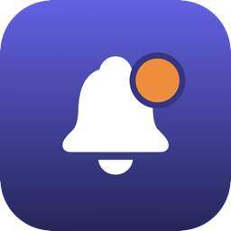

<p align="center">
  
</p>

<h1 align="center">Heads Up</h1>

A macOS menu-bar app that blocks your screen full-screen just before a meeting starts, so you can't miss it.

## What it does (v1 / MVP)

- Reads events from every calendar connected to macOS Calendar (Google, Outlook, iCloud — anything Calendar.app syncs) via EventKit.
- Detects a meeting join link on each event, checking the event URL, then location, then notes, preferring known providers (Zoom, Google Meet, Teams, Webex, and others — see `Sources/HeadsUp/MeetingLink.swift`).
- Shows a full-screen, borderless alert on every display — above other windows and full-screen apps — a configurable amount of time before each meeting (default: 1 minute before).
- Alert has Join, Snooze, and Dismiss; snooze duration is configurable.
- Menu bar item shows the next upcoming meeting, lets you change the default alert lead time, and lists every calendar so you can include/exclude it or give it its own lead-time override.
- "Send Test Alert" menu item previews the full-screen alert on demand.

## Install

1. Download the latest `HeadsUp.app.zip` from [Releases](https://github.com/rufushonour/headsup/releases) (no releases published yet — coming soon), then unzip it.
2. Open `HeadsUp.app`. macOS will block it with **"HeadsUp.app" Not Opened** — click **Done**.
3. Go to **System Settings → Privacy & Security**, scroll to the Security section, and click **Open Anyway** next to the line about HeadsUp being blocked. Confirm when prompted.
4. Approve the Calendar access prompt when it appears.

This extra step is because the app isn't signed with an Apple Developer ID (that's a £100/year program) or notarized by Apple, so Gatekeeper doesn't recognize it as coming from a known developer. It's a one-time thing per download — after you click Open Anyway once, it launches normally from then on.

## Requirements

- macOS 13+ to run. Built here with Xcode 14.1 / Swift 5.7 (that toolchain's SDK caps at macOS 13, so the granular macOS 14 EventKit permission API isn't used — the legacy `requestAccess(to:)` API is used instead and works fine on newer macOS too).
- Calendar access — macOS will prompt on first launch. Approve it in System Settings → Privacy & Security → Calendars if you miss the prompt.

## Build & run

```
./Scripts/build_app.sh          # debug build -> build/HeadsUp.app
./Scripts/build_app.sh release  # release build
open build/HeadsUp.app
```

The script compiles via Swift Package Manager, packages the binary into a proper `.app` bundle with `Info.plist` (needed for the Calendar permission prompt to attach to the app rather than to Terminal), and ad-hoc code-signs it.

For iterating on Swift code directly:

```
swift build
swift run   # note: permission prompts attach to whatever process invokes EventKit,
            # so prefer the packaged .app for testing calendar access
```

## Project layout

- `Sources/HeadsUp/CalendarService.swift` — EventKit access, polling, alert scheduling/snooze.
- `Sources/HeadsUp/MeetingLink.swift` — join-link detection.
- `Sources/HeadsUp/AlertPresenter.swift`, `AlertView.swift` — the full-screen alert (one borderless window per screen).
- `Sources/HeadsUp/MenuBarController.swift` — status bar item and preferences menu.
- `Sources/HeadsUp/AppDelegate.swift`, `main.swift` — wiring and entry point.
- `Resources/Info.plist` — bundle metadata and calendar usage descriptions.
- `Scripts/build_app.sh` — SPM build → `.app` packaging → ad-hoc codesign.
